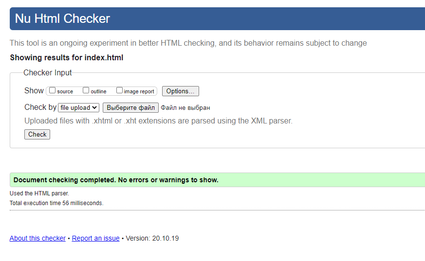
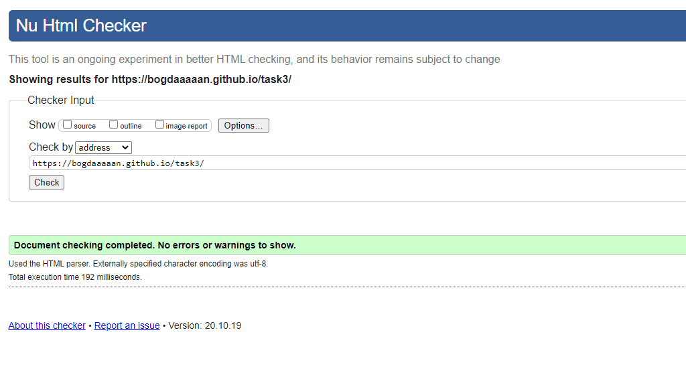

**Срок отправки 25.10.2020**

**Срок защиты 06.11.2020**

Сверстать одну страницу сайта. Это может быть на ваш выбор: каталог товаров ([rozetka.ua](http://rozetka.ua/), [autosuche.de](http://autosuche.de/), [lamoda.ua](http://lamoda.ua/)), лендинг, модный блог, страница-презентация продукта (авто - [https://www.volkswagen.ua/tiguan](https://www.volkswagen.ua/tiguan), мебель - [moooi.com](http://moooi.com/) ..., ipad/macbook [https://www.apple.com/ipad-air/](https://www.apple.com/ipad-air/)), или другой тип сайта.

1. Обязательно использовать:
    - flex-box: можно для меню, для колонок (текст), для колонок (товары)
    - grids: можно для свойств товаров, которые вы хотите разместить в несколько колонок и строк.
    - media-queries: поддержка 2х дисплеев - шириной до 1280 + выше 1280. На ширине окна менее 1280px у вас не просто должно все «сжаться», но и «адаптироваться» - т.е. некоторые блоки поменять свое положение (количество колонок уменьшится - в главном блоке, но и во второстепенных вложенных тоже контент может менять свое расположение относительно соседних блоков)
    - Анимации 2х видов: transition (обязательно) + keyframes/requestAnimationFrame (на выбор, обе при желании). Допускается js файл для работы с анимациями. Сторонние библиотеки использовать НЕЛЬЗЯ. Примеры функциональных (полезных) анимаций: [autosuche.de](http://autosuche.de) (same as [volkswagen.ua](http://volkswagen.ua)) - а. выезжающее меню по нажатии на кнопку (тоже самое с фильтром на странице каталога); б. прячущийся/появляющийся при скролле логотип vw.
    - Должен быть: минимум один элемент с position: sticky; минимум один элемент/блок c position: ~~absolute~~ fixed. Идеи для "position: ~~absolute~~ fixed":
    - Для размеров шрифтов (не всего подряд текста, а для заголовков например) - можно использовать vh. А также применить em.
    - В разметке - теги h1, h2, div, p, ul, li, main, nav, a, span, img, input (type=«text») (например, для «поиска» или «подписки»), button. (input и button обязательно стилизировать)
    - В CSS - свойства margin, padding, line-height, border, border-radius, box-shadow, background-image (url + gradient), transform (возможно в анимациях, но не обязательно в них)
2. Препроцессоры CSS использовать МОЖНО (но не обязательно), постпроцессоры - НЕЛЬЗЯ. В случае если будете использовать конфиг вебпака или gulp - позаботьтесь о том чтобы выкинуть из них лишние операции.
3. Страничка должна быть залита на Github и Github Pages.
4. Разметка в html5 формате и ваша страничка обязательно должна пройти валидацию на [https://validator.w3.org/](https://validator.w3.org/). Скрин с валидацией - прикрепить в [Readme.md](http://readme.md/) файле на Github.
5. Страничка должна быть продемонстрирована в 3х последних версиях браузеров Chrome, Firefox, Opera. Адаптивность и отзывчивость (responsive) - должна поддерживаться во всех.
6. Ширина контента на странице не должна быть фиксированной, а должна занимать всю ширину окна браузера (с небольшими отступами, само собой разумеется). И должна соответственно изменяться с изменением размера окна.
7. НЕЛЬЗЯ использовать сторонние CSS библиотеки. Кроме normalize.css либо reset.css (либо их локальные копии) - для того чтобы унифицировать вид ваших элементов во всех браузерах.
8. Можно использовать табличную верстку, но рабочие флексбоксы и гриды обязательно должны присутствовать на странице. Таблицы можно использовать только непосредственно для табличного контента.
9. На страничке обязательно должен быть:
- header (обычно c меню, но не обязательно), 
- футер с несколькими «меню» и информацией,
- основной блок, состоящий из минимум 3х основных подблоков (например, для каталога товаров это - блок с фильтрами, сетка товаров, пагинация/информация о количестве товаров; для других типов страниц - это может быть блок со статьей, блок с табличкой переключающейся по клику, галерея). 
*табличка, переключающаяся по клику ([https://mitsubishi.niko.ua/model/newl200/#description](https://mitsubishi.niko.ua/model/newl200/#description)):
10. Минимальное количество кода (не требование, но чтобы вы ориентировались): для html - 150, для css - 220 (это без учета reset или normalize).

В тексте задания я упоминал сайты **ДЛЯ ПРИМЕРА**. Отдельные решения смотреть как устроены и использовать на своей страничке Можно и Нужно. Посмотрите как эти сайты реагируют на изменения размера окна. **НЕ предполагается что ваша страничка будет по сложности конкурировать с production версиями маркетинговых сайтов.**

Будет оцениваться поддержка разрешений, браузеров и ширины дисплея (в том плане что ваш контент, тексты, не должны никуда «съезжать» и «разваливаться»). В тоже время сам дизайн вашей страницы тоже буду принимать во внимание.

**Дополнительный балл** за адаптивную верстку под мобайл (меньше 560px) ИЛИ дисплеев шире 1600 пикселей (+ 1 полноценный media query).

**Дополнительные 0,5 балла** за параллакс эффект (контейнер с изображением, либо другая комбинация слоев. пример [https://materializecss.com/parallax-demo.html](https://materializecss.com/parallax-demo.html)), (без сторонних библиотек, на чистом js+css).

Validator check (23.10):
    
    
